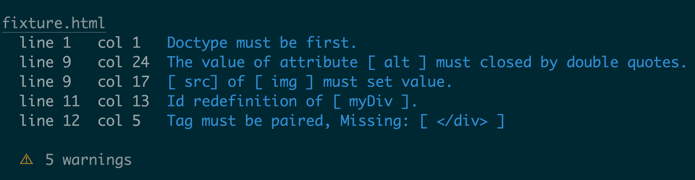
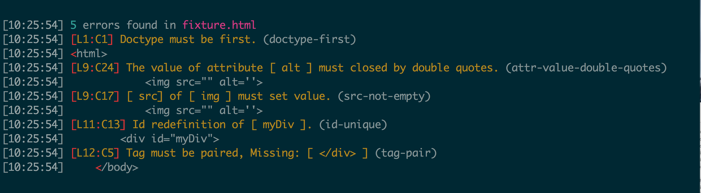

# htmlhint-stylish [](https://travis-ci.org/doshprompt/htmlhint-stylish)

> Stylish reporter for [HTMLHint](https://htmlhint.com)

Uses [jshint-stylish](https://github.com/sindresorhus/jshint-stylish) to do the actual reporting:



Compared to the default reporter:



## Install

```
$ npm install --save-dev htmlhint-stylish
```

## Usage

### [gulp-htmlhint](https://www.npmjs.com/package/gulp-htmlhint)

```js
var gulp = require('gulp');

gulp.task('default', function () {
    gulp.src(['index.html'])
        .pipe(htmlhint('.htmlhintrc'))
        .pipe(htmlhint.reporter('htmlhint-stylish'))
        .pipe(htmlhint.failReporter({
            supress: true
        })); // if you want to your task to fail on error(s)
```

## License

MIT © [Rahul Doshi](http://twitter.com/doshprompt)
